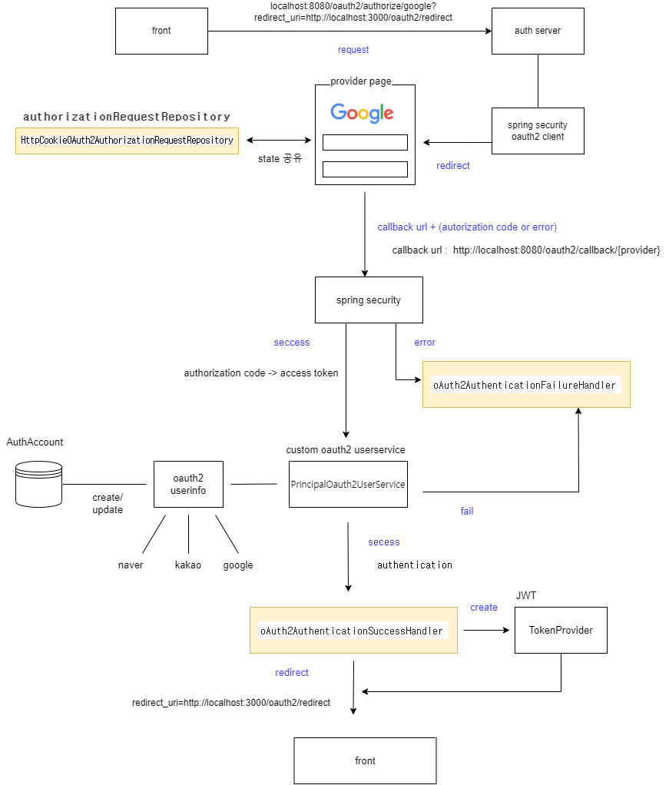

## 월드컵 AUTH 서버

------------

네이버, 카카오, 구글 사용가능

-----
### docker

도커 이미지
* docker pull tjwjdgks43/code-etc-authserver:<version 이름> (ex v.0.0)

실행 예시
- docker run -d -p <user-port>:8080 --name=<custom-name> tjwjdgks43/code-etc-authserver:<version 이름>

------------
### swagger api <br>
http://localhost:8080/swagger-ui/index.html

**back url**

리프레쉬 토큰은 refreshToken 테이블로 관리한다
token 검증 경우 토큰 유효성 검사와 새로운 토큰을 재발급한다

http://localhost:8080/auth/token <br>
access 토큰 인증 및 재발급 <br>
request : access token <br>
response : 새로운 access token

http://localhost:8080/auth/token/refresh <br>
refresh 토큰 인증 및 재발급 <br>
request : refresh token <br>
response : 새로운 refresh token<br>


**front url**

http://localhost:8080/oauth2/authorize/{provider}?redirect_uri=

provider Id는 naver, kakao, google

oauth 사용하는 경우 : redirect_url 제공

* http://localhost:3000/oauth2/redirect
* http://localhost:8080/auth/home

서비스 로그인을 사용하는 경우

* 회원가입 : http://localhost:8080/auth/signup
  * param : name, email, password 
  * method : post
* 로그인 : http://localhost:8080/auth/login
  * param : email, password
  
-----
oauth 해당 redirect 으로 query param 제공
* param : token, refreshToken, tokenExpiredAt, tokenType

서비스 로그인 경우 reponse body에 전달 
* param : token, refreshToken, tokenExpiredAt, tokenType

-----
### spring oauth flow



------

AuthAccount Table

```
class AuthAccount{
  Long id
  String username
  String userId
  String password
  String email;
  Role role; // Enum {ROLE_USER, ROLE_ADMIN, ROLE_MANAGER}
  Provider provider; // Enum {local, naver, google, kakao}
 
} 
```
