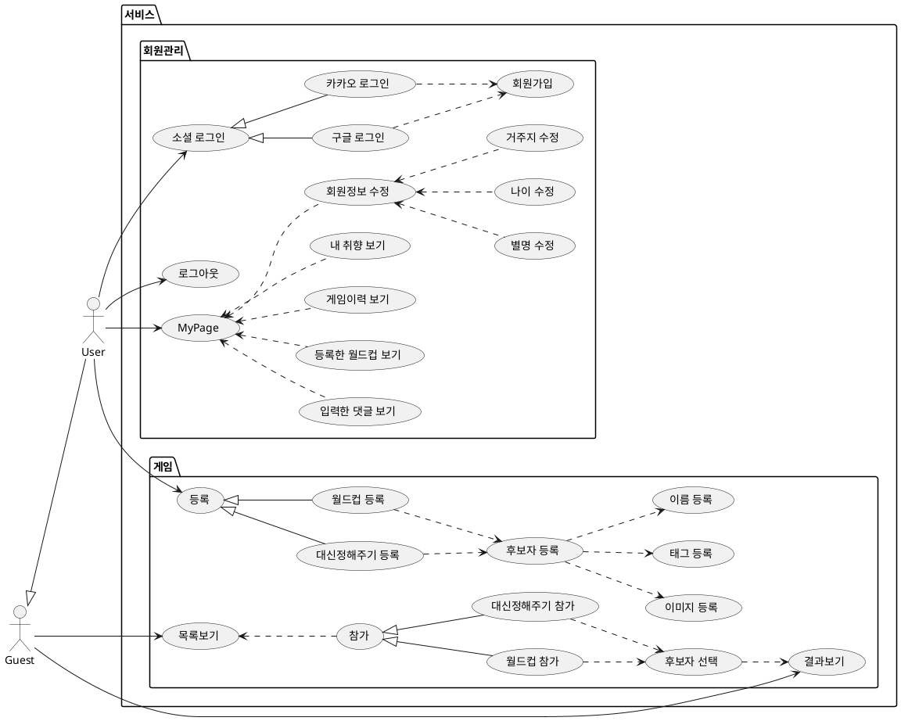
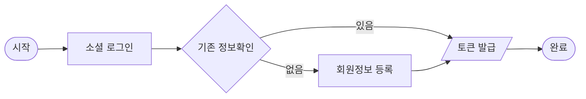
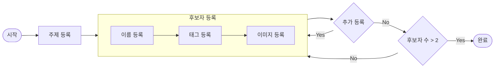

# 기능분석

## Usecase Diagram

    

    PlantUML 소스코드
    

## Flowchart Diagram

### 로그인

> - OAuth2 로 진행된다.
> - OAuth2 은 기본적인 정보활용 동의를 구한다.
> - IDP(IDentity Provider)의 제공정보를 회원정보로 활용한다.

### 게임 등록

> - __월드컵/대신정해주기__ 는 게임정보(주제 등)와 후보자를 등록한다.
> - 후보자는 이름/태그/이미지를 갖게 되며, __2개 이상의 후보자__ 등록이 요구된다.

